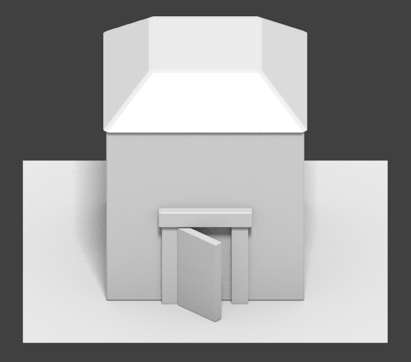

Liberated Pixel Cup styleguide
==============================

Preamble?  Rationale?
---------------------

The purpose of this style guide is to allow pixel artists to
collaborate on a top-down set of artwork and produce content that is
stylistically coherent.  Currently there is a lot of artwork in the
commons for games, but it's hard to get it to work together.  We've
been greatly inspired by work by the `Tango Project
<http://tango.freedesktop.org/>`_ and the work they've done.  To that
end we've intentionally built a style guide for artwork that should be
easy to collaborate on for both intermediate and advanced pixel
artists.

Inspired roughly by a variety of 16 bit era top-down games along the
lines of Harvest Moon, Zelda: A Link to the Past, Final Fantasy,
et cetera.  Many games from this perspective are RPG like, but we hope
this style guide will be useful for a variety of games... indeed, we
chose this style because of its versatility: we hope
farming/simulation games, strategy games, top-down shooters, puzzle
games, and of course also RPGs, will be built from artwork built with
this style.

This guide is not a tutorial on how to make pixel art generally, but
rather a specification for a particular style.  If you are new to
pixel art entirely, we recommend you check out the resources at the
bottom first before proceeding.

Basics
------

The general tile grid is 32x32 with (possible) sub tiles at 16x16.
The rational being that the basic size of a square object (eg a chair
or a character) is a 32x32 area, for versatility tileing happens at
16x16 resolution. (Everything I've made tiles at 32x32.  16x16 is just
an option.  The way this is worded implies that everything that tiles
has to do it at 16x16 and can't be bigger.)

TODO: Sort out the above

[Image showing scene on a grid shown here]

Only sprites may have black outlines; if tiles have outlines they must
be colored.  The only exception is if your tile is meant to be colored
black.

Dithering should be used sparingly if at all.  None of the base
artwork has dithering.

TODO: Zoomed (and not enhanced) example of outlines here, with further
text :) (some commentary on re-wording here, when further text is
written

Perspective
-----------

The camera angle is top-down, roughly 60 degrees.

Rendering should be orthographic, which means there is *no*
perspective... things don't get smaller as they move into the
distance.  If you're using perspective techniques on individual props,
ur doin it wrong.

The following image is a 3d rendering demonstrating orthographic
projection.  For examples of actual proportions, see existing body of
pixel art.

TODO: Show some examples of objects.

Lighting and shading
--------------------

Roughly a "toon style rendering" with medium-low levels of texturing.
We want some detail, but not so much that things are so ornate that it
might make collaboration difficult.  We don't want things to be
"noisy" either.  But detail is good.  Texturing should have a
toon-style; this is accomplished with medium to low amounts of
texturing.  Details should be used sparsely, so make them count!

Shade in blocks.  Begin drawing by blocking out the object first,
paying attention to its volume.  Lines should be added afterward, and
generally only around the edges and with very important details.
Details should mostly be implied by form and color, not by outlines.

TODO: give pictures showing various stages of the workflow for something
like, say, a cracked rock

Outdoor lighting should come from above, with a light source slightly
to the left.  Inside lighting shouting should be dead center from
above.  Anything that is meant to be both inside and outside or that
has a very small impact on the scene should be lighted from above.

TODO: Add illustration

When deciding how to highlight objects, pay attention to the color of
the light in the surroundings.  This includes indirect light (that is,
light bouncing off of other objects). (Not sure indirect light is
useful in a tile situation) ----- because objects don't necessarily
need to be in a fixed context; eg a barell might be in the
sewerbasement, in the living room, or outside the house, or on top of
a house, or on a mountain, or in a castle, or on a space ship... *deep
breath* it might be best not say anything at all about the effect of
ambient lighting on the object's appearance. I think we should
subtract this bit.

TODO: Resolve above.

Lighting in a given scene should feature a hue shift between
highlights and low lights.  The best way to do this is to first pick
the dominant color of an object.  This dominant color will tend to be
more warm with outside objects and more cool with inside objects.  To
create the lowlight color, move the hue (hsv selector) slightly
towards the closest purple.  To create highlight color, move the hue
slightly towards the closest yellow.  Adjust as necessary until it
looks "right".

Inside, things will be cooler in overall color, with slightly less
contrast.  This is doubly true for things like basements, caves and
other underground areas.

All drop shadows should be done with the color #322125 at 60 percent
opacity.  If it makes sense, one may also provide a combined version
of two tiles, so only one layer is needed to, say, put a house on a
grass background.

Color
-----

* Don't reach for that RGB color selector.  See that #00ff00 swatch
  that you're thinking about using for grass?  Don't do it!  If your
  color has a zero as any of the RGB components, it's probably not a
  good color to use.
* No colors are pure.  Saturation should be high, but no #00FF00 for
  green please..

* To put it simply, don't think of colors in terms of numbers.  Use
  the HSV color picker.

* Your light to dark color ramps should *never* all have the same hue.
  Vary the hue and saturation a bit as you go from light to dark, or
  your objects will look flat.

Outlines
--------

 * Should be a darker version of the current color, not black.

Hue Shifting
------------

 * Shadows should head towards the blue/purple end of the spectrum.
 * Highlights should head towards the yellow end of the spectrum.

Tile authoring
--------------

Details are simplistic.  There are more details on the edges, and the
center tile should be either one color or a very subtle pattern.

Occasional detail tiles should be thrown in to break the monotony of
having a single repeating tile.

Edged tiles such as walls and floors should be arranged in a similar
manner as the establishing art.

[examples here]

TODO: Should we make notes on external scenes versus internal scenes? Yes. Absolutely =)

TODO: Examples go here.  Important examples which illustrate things:
 * grass tiles and edges
 * Buildings
 * Interior walls, including entrances/exits

Characters
----------

Characters should have their own color palettes so that they stand out
from the background.  Drop shadows should follow the same rule as the
tiles, #322125 at 60% opacity.

Characters are squashed, roundish, and not realistically proportioned.
Bases are approximately two and a half heads tall and in the same
perspective as the tiles.  The base should fit in a 32x48 space and
the clothing should fit in 48x64 space.  The outlines should be black
or near black, no selective outlining.

TODO: [insert example human base here]

Monsters are cute so far.

TODO: Expand above wording
TODO: [insert example monster bases]

Props and other objects
-----------------------

Props should be colored so that they don't blend in with the
surrounding background tiles (vary color, brightness, and saturation
to provide contrast).

large difference in lighting between sides and top[be more specific,
and give a visual example]

Props should have shadows, or they will appear not to be part of the
scene.  Shadows should follow the same transparency blending rules as
mentioned in the "lighting and shadows" section above.

Things that are important enough to be worth repeating
------------------------------------------------------

 * No pure colors!
 * Vary the hues of your color ramps!
 * Highlighted areas are yellow-ish, shadowed areas are purple-ish.
 * Block your art out first, including shadows, before adding detail.

Useful, generalist resources
----------------------------

These articles do not directly apply to the style we are building
here, but may help people get involved:

Pixel Tutorials:

* http://tkool.jp/fancontents/lecture/graphic/ -- It's in Japanese,
  but the tutorials are thorough and the art is all you really need to
  figure out what they're teaching.
* http://gas13.ru/v3/tutorials/ -- Excellent for teaching the why of
  pixel art, not just the how.  "So you want to be a Pixel Artist" is
  highly recommended.
* http://www.pixeljoint.com/forum/forum_posts.asp?TID=11299 -- A good
  general course on what pixel art is and how to start making it.
* http://opengameart.org/content/les-forges-pixel-art-course A pixel
  art course that's so good that we translated and mirrored it.
  Originals in French here: http://www.lesforges.org/tag/pixel%20art

