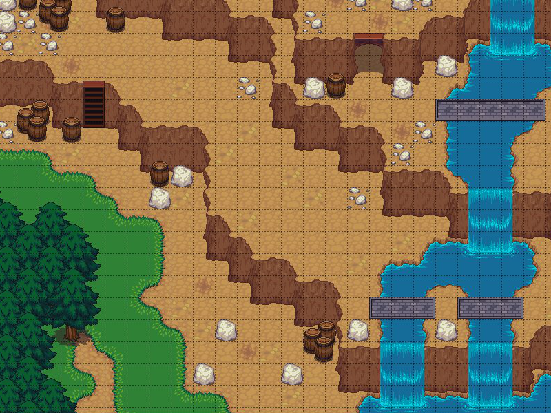
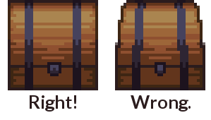
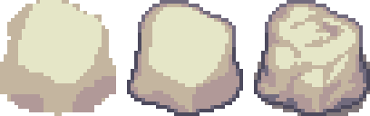
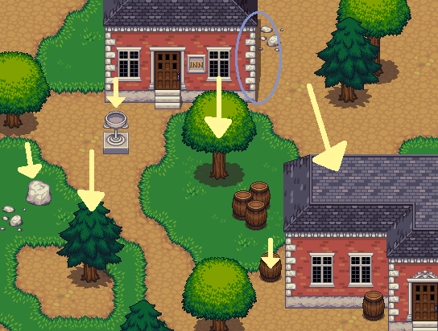
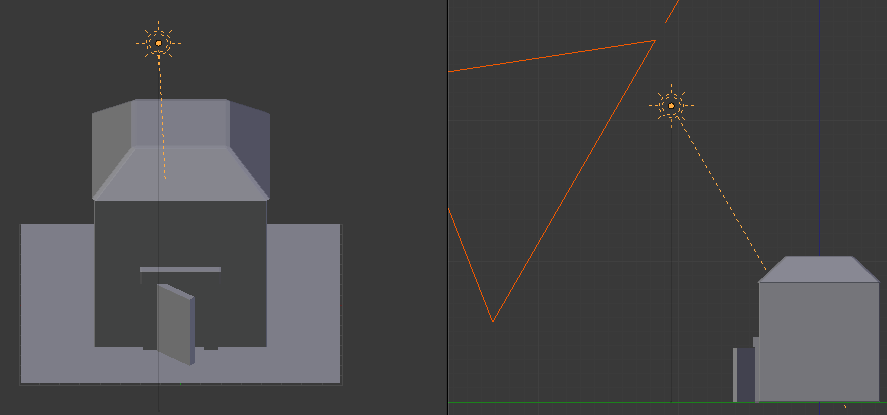
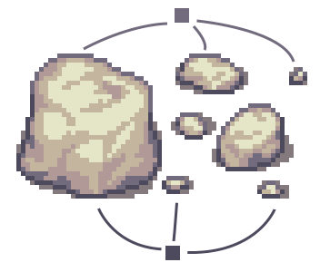
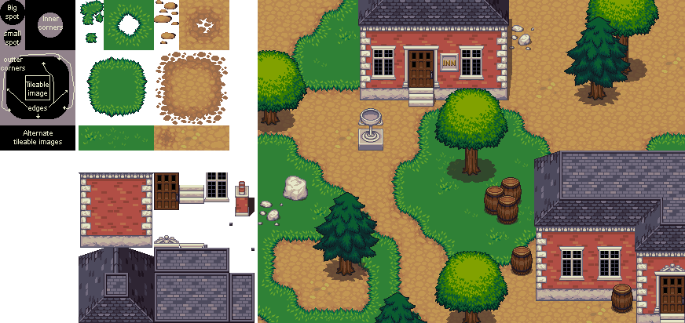
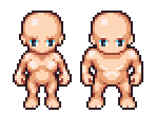
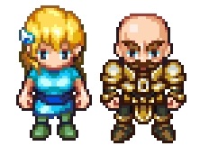
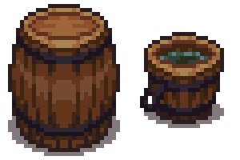

Liberated Pixel Cup styleguide
==============================

Preamble / Rationale
--------------------

The purpose of this style guide is to allow pixel artists to
collaborate on a top-down set of artwork and produce content that is
stylistically coherent.  Currently there is a lot of artwork in the
commons for games, but it's hard to get it to work together.  We've
been greatly inspired by work by the `Tango Project
<http://tango.freedesktop.org/>`_ and the work they've done.  To that
end we've intentionally built a style guide for artwork that should be
easy to collaborate on for both intermediate and advanced pixel
artists.

Inspired roughly by a variety of 16 bit era top-down games along the
lines of Harvest Moon, Zelda: A Link to the Past, Final Fantasy,
et cetera.  Many games from this perspective are RPG like, but we hope
this style guide will be useful for a variety of games... indeed, we
chose this style because of its versatility: we hope
farming/simulation games, strategy games, top-down shooters, puzzle
games, and of course also RPGs, will be built from artwork built with
this style.

This guide is not a tutorial on how to make pixel art generally, but
rather a specification for a particular style.  If you are new to
pixel art entirely, we recommend you check out the resources at the
bottom first before proceeding.

Grid size
---------

The general tile grid is 32x32 with (possible) sub tiles at 16x16.
The rationale being that the basic size of a square object (eg a chair
or a character) is a 32x32 area.  All base assets are designed to work
at 32x32 tiling, and it's recommended that you build yours to be so as
well.  However, for versatility tiling can happen at 16x16 resolution.

Perspective
-----------

The camera angle is top-down, roughly 60 degrees.

Rendering should be orthographic, which means there is *no*
perspective... things **do not** get smaller as they move into the
distance.  If you're using perspective techniques on your props or
tiles, that's wrong.

The following image is a 3d rendering
(`source <_static/images/perspective.blend>`_)
demonstrating orthographic projection.  For examples of actual
proportions, see existing body of pixel art.

.. image:: ../static/images/60perspective.png
   :alt: 60 degree camera perspective example

Lighting, colors, and shading
-----------------------------

Roughly a "toon style rendering" with medium-low levels of texturing.
We want some detail, but not so much that things are so ornate that it
might make collaboration difficult.  We don't want things to be
"noisy" either.  But detail is good.  Texturing should have a
toon-style; this is accomplished with medium to low amounts of
texturing.  Details should be used sparsely, so make them count!

Shade in blocks.  Begin drawing by blocking out the object first,
paying attention to its volume.  Lines should be added afterward, and
generally only around the edges and with very important details.
Details should mostly be implied by form and color, not by outlines.

Lighting should primarily come from above.  If there is any side
directionality, it should come from the left, but not by much: keep it
mostly center.

An `example scene in blender <_static/images/perspective.blend>`_ with
a sun light pointing in the appropriate location:

*Left example shows from the "top-facing" camera used in this style;
right example shows a sideview.  Yellow "sun" with ray is the light
source, big orange triangle on right is the camera.*

Your light to dark color ramps should *never* all have the same hue.
Vary the hue and saturation a bit as you go from light to dark, or
your objects will look flat.

To create shadows or lowlights, once you have the main color the shade
you want it to be move the hue (hsv selector) slightly towards the
closest purple. To create highlight color, do the same but instead of
purple and shade move the hue slightly towards the closest yellow and
lighten it up. Adjust as necessary until it looks "right".

Inside, things will be cooler in overall color, with slightly less
contrast.  This is doubly true for things like basements, caves and
other underground areas.

All drop shadows should be done with the color #322125 at 60 percent
opacity.  If it makes sense, one may also provide a combined version
of two tiles, so only one layer is needed to, say, put a house on a
grass background.

Dithering should be used sparingly if at all.  None of the base
artwork has dithering.

There's no specific palette *required* for Liberated Pixel Cup asset
conformance, but it's generally best to try to match to the colors
used in the base set.  So that said, here's a palette that may be
useful in producing matching assets.

.. image:: ../static/images/colors.png
   :alt: Suggested palette

Outlines
--------

Outlines should be a darker version of the current color, or a dark
color generally, not black.  (Extreme circumstances obviously may have
exceptions.)

Tile authoring
--------------

Details are simplistic.  There are more details on the edges, and the
center tile should be either one color or a very subtle pattern.

Occasional detail tiles should be thrown in to break the monotony of
having a single repeating tile.

Edged tiles such as walls and floors should be arranged in a similar
manner as the establishing art.

*Demonstrating creating tiles that can be used to make more complex
patterns.*

Characters
----------

Characters should have their own color palettes so that they stand out
from the background.  Drop shadows should follow the same rule as the
tiles, #322125 at 60% opacity.

Characters are squashed, roundish, and not realistically proportioned.
Bases are approximately two and a half heads tall and in the same
perspective as the tiles.  The base should fit in a 32x48 space and
the clothing should fit in 48x64 space.  The outlines should be black
or near black, no selective outlining.

We have provided a :ref:`character base <assets-character-base>` that
you can accessorize.  (Of course, deviating from this base is
perfectly fine if it makes sense; just try to keep your work within
the style as described in this document and squashed stylization we
keep generally for characters.)

If you are making an animation sheet that has multiple perspectives,
you should generally vertically sort that sheet into rows in this
order: back, left, front, right.  Having the sprites arranged this
way simplfies the code side of things a little bit.

.. image:: ../static/sprites/female_spellcast.png
   :alt: Spellcasting female to demonstrate direction

These concepts can generally be expanded to monsters and other
creatures, of course accounting for different proportions of said
characters.

Props and other objects
-----------------------

Props should be colored so that they don't blend in with the
surrounding background tiles (vary color, brightness, and saturation
to provide contrast).

There's should be a large difference in lighting between the sides and
the top of objects.  Look at these objects as example:

Props should have shadows, or they will appear not to be part of the
scene.  Shadows should follow the same transparency blending rules as
mentioned in the "lighting and shadows" section above.

Things that are important enough to be worth repeating
------------------------------------------------------

 * No pure colors!
 * Vary the hues of your color ramps!
 * Highlighted areas are yellow-ish, shadowed areas are purple-ish.
 * Block your art out first, including shadows, before adding detail.

Useful, generalist resources
----------------------------

These articles do not directly apply to the style we are building
here, but may help people get involved:

Pixel Tutorials:

* http://tkool.jp/fancontents/lecture/graphic/ -- It's in Japanese,
  but the tutorials are thorough and the art is all you really need to
  figure out what they're teaching.
* http://gas13.ru/v3/tutorials/ -- Excellent for teaching the why of
  pixel art, not just the how.  "So you want to be a Pixel Artist" is
  highly recommended.
* http://www.pixeljoint.com/forum/forum_posts.asp?TID=11299 -- A good
  general course on what pixel art is and how to start making it.
* http://opengameart.org/content/les-forges-pixel-art-course -- A pixel
  art course that's so good that we translated and mirrored it.
  Originals in French here: http://www.lesforges.org/tag/pixel%20art
* http://www.natomic.com/hosted/marks/mpat/ -- Decent set of resources,
  though most important is maybe the `shading piece
  <http://www.natomic.com/hosted/marks/mpat/shading.html>`_ which
  describes how to avoid the dreaded "pillow shading" style and think
  about lighting placement.

Tiling:

* http://www.squidi.net/mapmaker/musings/m091016.php -- Describes
  patterns for reusable tiling
* http://www.codeproject.com/Articles/106884/Implementing-Auto-tiling-Functionality-in-a-Tile-M
  -- another tiling pattern, simpler than the "blob" pattern above
